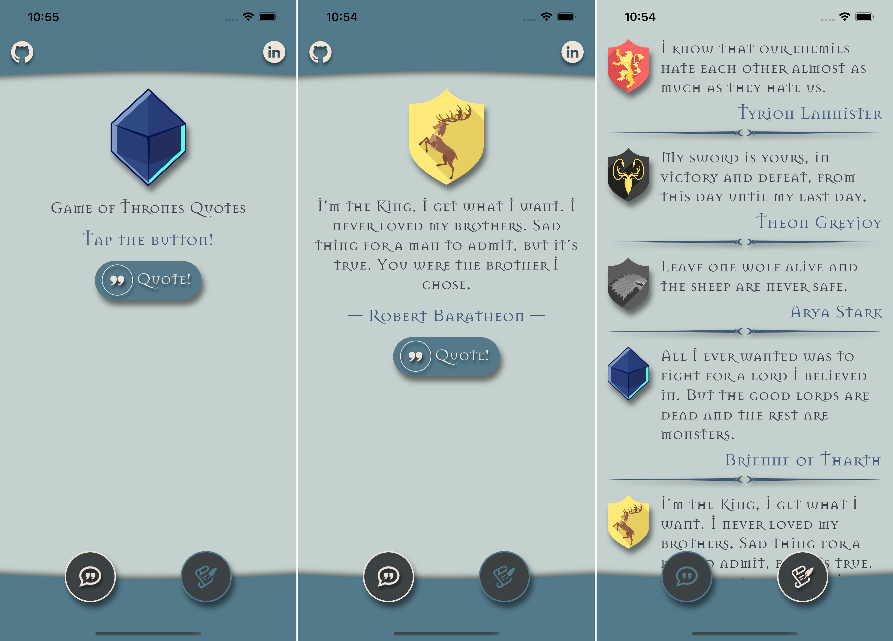
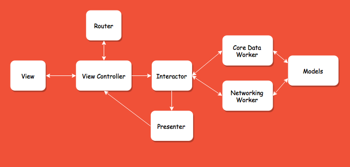

# Game-Of-Thrones-Quotes
A client app that implements [game-of-thrones-quotes-api](https://gameofthronesquotes.xyz/). I made this application for my own sake to understand the basic principles of developing native iOS applications. And also to show off that I mastered the development of iOS applications in just 1 week 😜.

 

The application is made according to the principles of Clean Swift architecture. This architecture is also called VIP.

 

Big thanks to [shevabam](https://github.com/shevabam) for his open-API project and the icon for this app!

 

